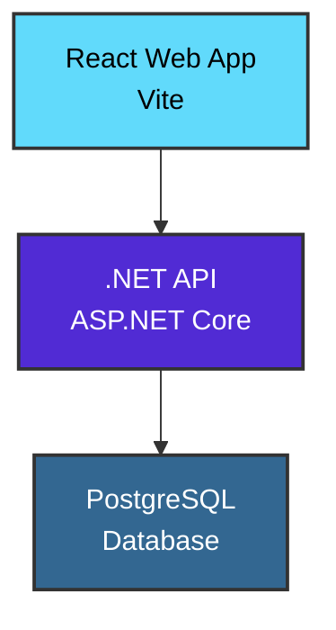

# PlateLib

An open source microwell plate library.

Scalar API docs at localhost:7034/api

Run project using apphost launch profile or .vscode launch profile

## Requirements
- .NET 10.0 SDK
- Docker

## Tech Stack

