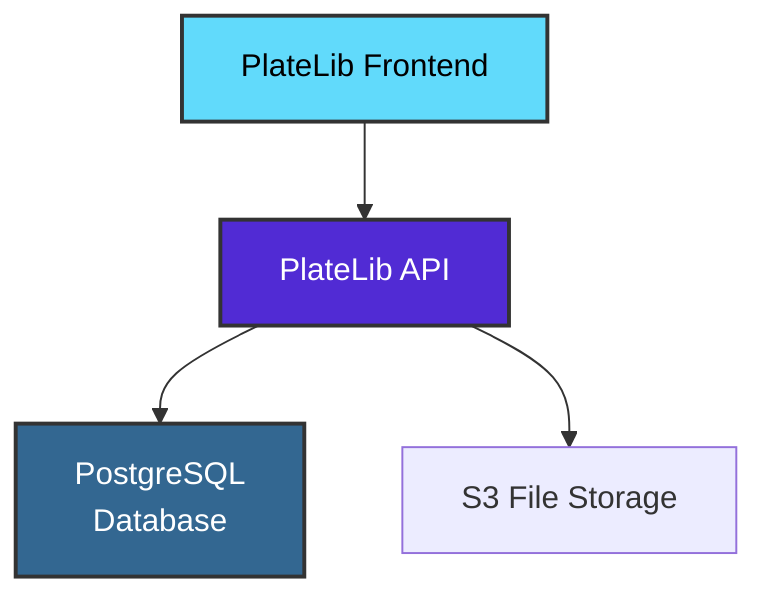

# PlateLib


**An open-source labware library for well plates — built for scientists, automation engineers, and anyone who works with microwell plates.**

[platelib.com](https://platelib.com) · [API docs](https://platelib.com/api)

---

Finding reliable, structured information about well plates shouldn't be hard. Plate dimensions, well counts, materials, skirt types, drawings, datasheets — this information is scattered across manufacturer websites and PDFs. PlateLib exists to aggregate it all in one place so you can stop searching and get back to what matters.

PlateLib exposes a **public API** so the data can be used freely in derivative products — lab instruments, LIMS systems, automation scripts, or anything else that benefits from structured labware data. The idea grew out of our own need at [Aventix](https://aventix.io) to give our instrument [Scarlett](https://aventix.io/product/) a reliable, up-to-date source of labware information to sync against.

> ⚠️ **Early stage** — PlateLib is in active early development. Breaking changes to the API and data model are likely.

---

## Contributing

PlateLib is open source — contributions are welcome on both the **code** side and the **labware data** side. Whether you want to add a missing plate, improve the API, or build a new feature, we'd love your help. Contact us on [hello@aventix.io](mailto:hello@aventix.io)

Aventix hosts and maintains the plate library today, but our goal is to grow into a **community of maintainers** — people who keep the code healthy and the labware catalog accurate and comprehensive.

---

## Architecture


```mermaid
graph TD
    A[PlateLib Frontend] --> B[PlateLib API]
    B --> C[PostgreSQL<br/>Database]
    B --> D[S3 File Storage]

    style A fill:#61dafb,stroke:#333,stroke-width:2px,color:#000
    style B fill:#512bd4,stroke:#333,stroke-width:2px,color:#fff
    style C fill:#336791,stroke:#333,stroke-width:2px,color:#fff
```

| Layer | Technology |
|---|---|
| Frontend | React 19, TypeScript, Vite, TanStack Router/Query/Table, Tailwind CSS v4 |
| Backend | .NET 10, ASP.NET Core Minimal API, EF Core, FluentValidation |
| Database | PostgreSQL |
| Orchestration | .NET Aspire |

---

## Running Locally

### Prerequisites

- [.NET 10 SDK](https://dotnet.microsoft.com/download)
- [pnpm](https://pnpm.io/installation)
- [Docker](https://www.docker.com/)

### Start the app

```bash
# From the repository root — starts API, database, and frontend via Aspire
dotnet run --project AppHost
```

The Aspire dashboard will open and show all running services. The API includes a Scalar UI at `localhost:7034/api`.

To run the frontend dev server standalone:

```bash
cd Web
pnpm install
pnpm dev   # http://localhost:3000
```
